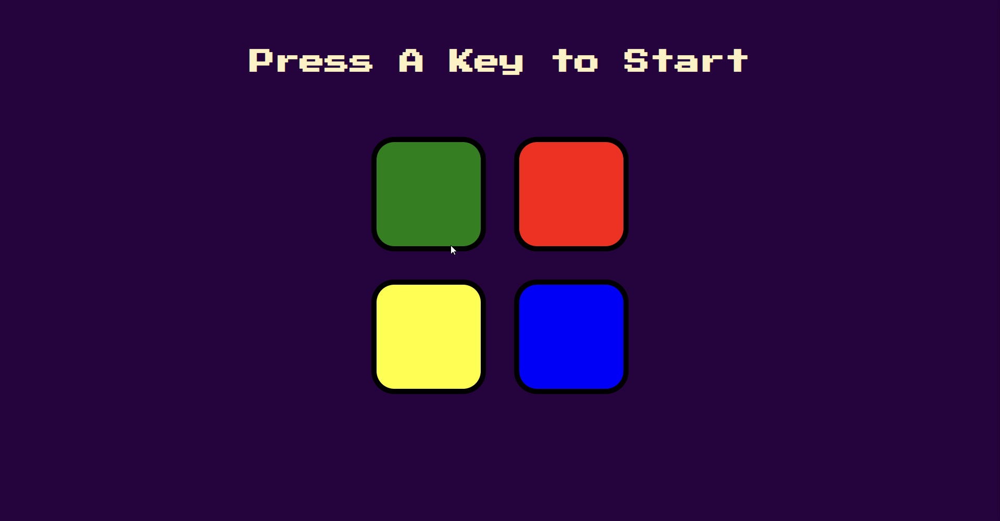

# Saturday Simon Game 🎮

Welcome to Saturday Simon Game! A classic memory game with a twist—perfect for a fun Saturday gaming session. Test your memory and reflexes as you follow the sequences of colors.

## How to Play 🕹️

1. Open the `index.html` file in your web browser.
2. Click the "Start" button to begin the game.
3. Pay attention to the sequence of colors flashed by Simon.
4. Repeat the sequence by clicking on the colored buttons.
5. The sequence gets longer as you progress. How far can you go?

## Features 🌟

- Simple and intuitive gameplay.
- Dynamic color sequences for an engaging experience.
- Keep track of your high score and challenge yourself to beat it.

## Technologies Used 💻

- HTML
- CSS
- JavaScript

